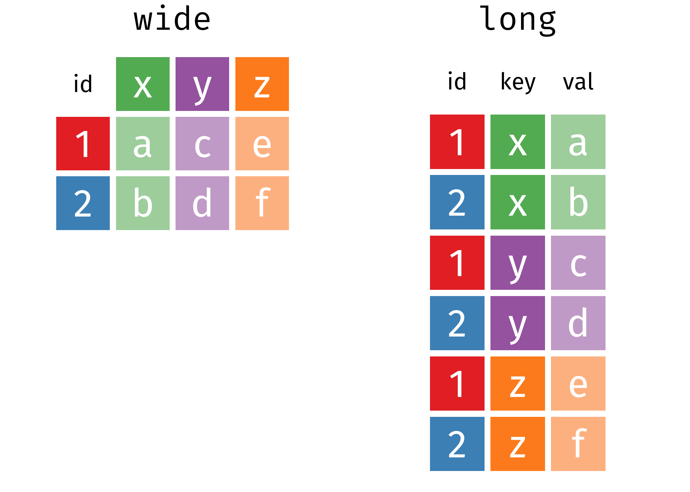

# Download first

Short url: <https://bit.ly/39a7RCI>
.center[

]

```{r message=FALSE, warning=FALSE}
# install.packages(tidyverse)
library(tidyverse)
```

---

# Outline

- introduction
- data.frame
- dplyr
- tidyr
- ggplot2

---

# Motivation

Data preprocessing takes 50-80% of your time in data analysis

Goal of Data Preprocessing  
- ake data suitable to use with a particular piece of software (i.e. R, - Python)  
- Reveal important information  
- Extract variables to analyze

---

# Hadley Wickham

- The Man Who Revolutionized R
- The Committee of Presidents of Statistical Societies Awards
- [tidyverse](https://www.tidyverse.org/)


---


---


---

# R packages for data science


---
class: inverse, center, middle

# data.frame


---

# data.frame create

```{r}
student <- data.frame(ID = LETTERS[1:12], 
                      math = round(rnorm(12, 50, 15), 1),
                      chinese = seq(4, 92, length.out = 12))
class(student)
student
```

--- 

# data.frame(): create

load data
```{r}
ebg <- read.csv("data/001_b_1110_1_1_p1.csv", 
                fileEncoding = "UTF-8")
head(ebg)
class(ebg)
```

---

# data.frame(): read

```{r, message=FALSE}
# []
ebg[1]
ebg["p1Cash"]

# [,]
ebg[1, 3]
ebg[1:10, 2:3]

# [[]]
ebg[[1]]

# $
ebg$StockPrice
ebg$p1Decision[61:100]
typeof(ebg)
```

---

# data.frame(): update

```{r}
student$psychology <- rep(c(59, 61), each = 2, times = 3)
student
```


---
class: inverse, center, middle

# dplyr

---

# tibble

```{r}
# install.packages("nycflights13")
data(flights, package = "nycflights13")
flights
```

---

# select()

```{r}
select(flights, year, month, day) # select(flights, year:day)
```

---

# filter()

```{r}
filter(flights, year %in% c(2012, 2013), month == 1, day < 4)
```

---

# sample_n() and sample_frac()

```{r}
sample_n(flights, 10) # fixed number
sample_frac(flights, 0.01) # fixed fraction
```

---

# arrange()

```{r}
arrange(flights, year, month, day)
```

---

# arrange(desc())

```{r}
arrange(flights, desc(arr_delay))
```

---

# mutate()

```{r}
mutate(flights,
       gain = arr_delay - dep_delay,
       speed = distance / air_time * 60)
```

---

# select(mutate())


```{r}
select(
  mutate(flights, 
         gain = arr_delay - dep_delay, 
         speed = distance / air_time * 60
  ),
  gain, speed
)
```

---

# transmute() = select(mutate())

```{r}
transmute(flights, 
          gain = arr_delay - dep_delay,
          speed = distance / air_time * 60)
```

---

# nested structure 

```{r, echo=FALSE}
filter(
  summarise(
    select(
      group_by(flights, year, month, day),
      arr_delay, dep_delay
    ),
    arr = mean(arr_delay, na.rm = TRUE),
    dep = mean(dep_delay, na.rm = TRUE)
  ),
  arr > 30 | dep > 30
)
```


---

# pip operator %>% 

```{r}
flights %>% 
  mutate(gain = arr_delay - dep_delay, speed = distance / air_time * 60) %>% 
  select(gain, speed)
```

---

# summarise()

```{r}
flights %>% 
  summarise(delay_mean = mean(dep_delay, na.rm = TRUE), 
            delay_sd = sd(dep_delay, na.rm = TRUE))
```

---

# group_by() %>% summarise()

```{r}
flights %>%
  group_by(year, month) %>% 
  summarise(delay_mean = mean(dep_delay, na.rm = TRUE), 
            delay_sd = sd(dep_delay, na.rm = TRUE))
```


---
# left_join(), right_join(), & inner_join()


---
class: inverse, center, middle

# tidyr

---

# long vs. wide table



---

# wide table

```{r}
student
```

---

# pivot_longer()

```{r}
student_long <- pivot_longer(student, 
                             cols = c("math", "chinese", "psychology"), # -ID 
                             names_to = "subjects", values_to = "score")
student_long
```

---

# pivot_wider()

```{r}
student_wide <- pivot_wider(student_long,
                            names_from = "subjects", values_from = "score")
student_wide
```

---

# Practice

請對 `ebg` 這筆資料，利用 `boxplot(y~group, data)` 畫出，依照不同 Money 種類 (group: p1Cash, p1Stock, p1TotalAsset) 的價格分佈。

--

```{r}
ebg_long <- pivot_longer(ebg, cols = c("p1Cash", "p1Stock", "p1TotalAsset"),
                         names_to = "money", values_to = "value")
boxplot(value ~ money, data = ebg_long)
```

---
class: inverse, center, middle

# ggplot2

---

# [Cheetsheet](https://www.rstudio.org/links/data_transformation_cheat_sheet)


---

# [Cheetsheet](https://www.rstudio.org/links/data_transformation_cheat_sheet)


---

# RStudio cheetsheets 

Link: <https://rstudio.com/resources/cheatsheets/>

In RStudio: Help > Cheetsheets > ...

---

# References
