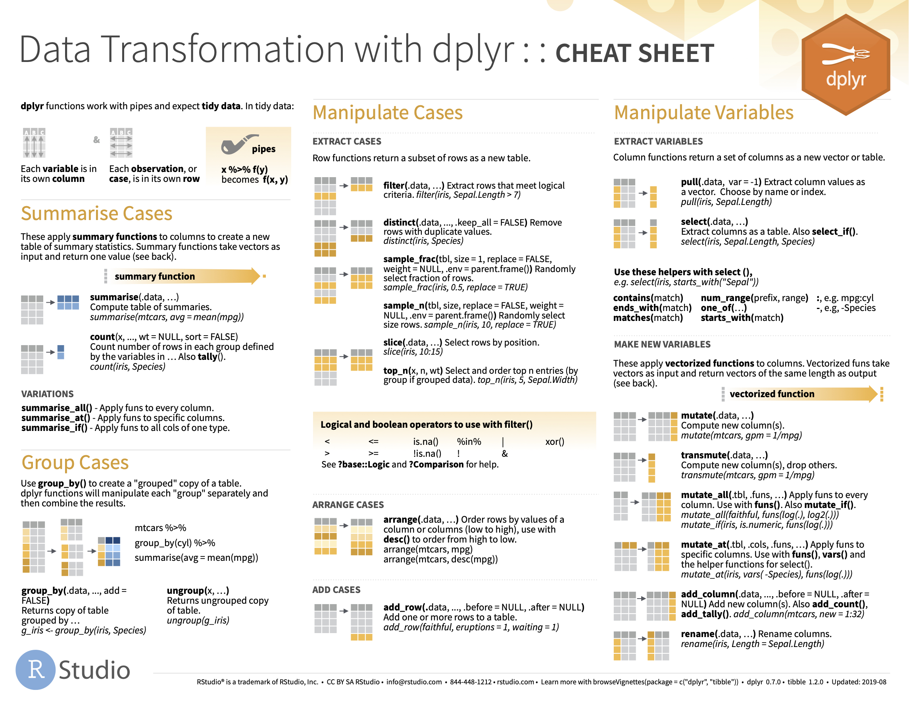
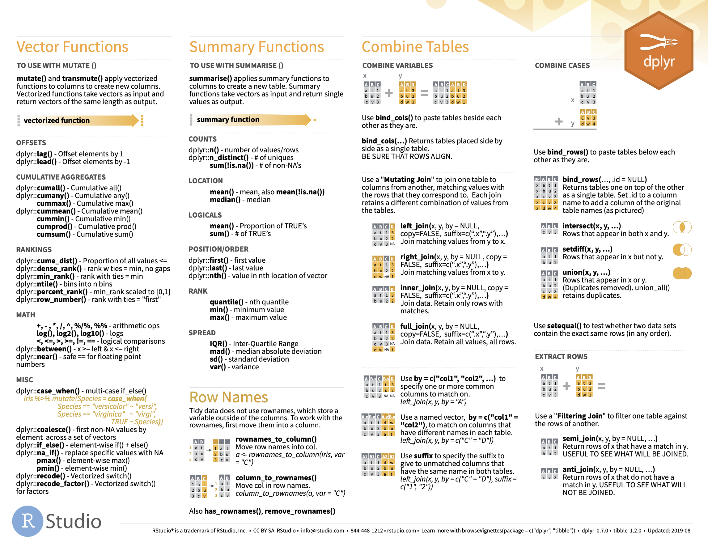
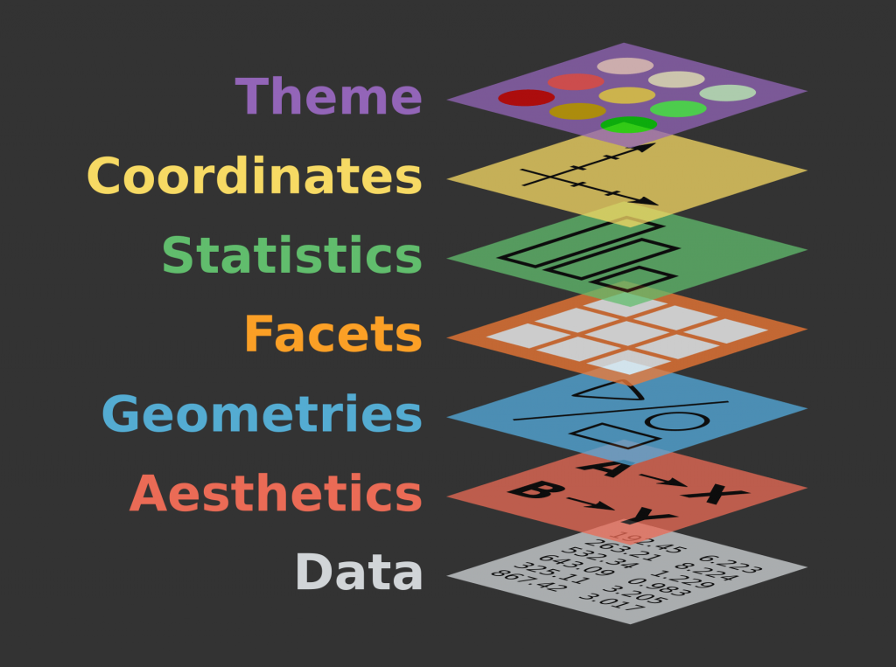

```{r setup, include=FALSE}
knitr::opts_chunk$set(echo = TRUE, comment = "",
                      dpi = 300, fig.align = "center", 
                      fig.width = 6, fig.asp = 0.618,
                      out.width = "80%")
```

# Download: <https://bit.ly/39a7RCI>

.center[]

```{r message=FALSE, warning=FALSE}
# install.packages(tidyverse)
library(tidyverse) # including dplyr, tidyr, & ggplot ...
```

---

# Outline

.Large[
- introduction
- data.frame
- dplyr
- tidyr
- ggplot2
]

---

# Motivation

Data preprocessing takes 50-80% of your time in data analysis

Goal of Data Preprocessing  
- Make data suitable to use with a particular piece of software (i.e. R, Python)  
- Reveal important information  
- Extract variables to analyze

---

# Hadley Wickham

- The Man Who Revolutionized R
- The Committee of Presidents of Statistical Societies Awards
- [tidyverse](https://www.tidyverse.org/)
.center[]

---

.center[]

---

.center[]

---

# R packages for data science

.center[]

---
class: inverse, center, middle

# data.frame

---

# data.frame(): create

```{r}
student <- data.frame(
  ID = LETTERS[1:12], 
  math = round(rnorm(12, 50, 15), 1),
  chinese = seq(4, 92, length.out = 12))
student
```

--- 

# data.frame(): create

load data
```{r}
ebg_011 <- read.csv("data/011_b_1114_1_1_p1.csv", 
                   fileEncoding = "UTF-8")
head(ebg_011)
class(ebg_011)
```

---

# data.frame(): read

```{r, eval=FALSE}
# []
ebg_011[1]
ebg_011["p1Cash"]

# [,]
ebg_011[1, 3]
ebg_011[1:10, 2:3]

# [[]]
ebg_011[[1]]

# $
ebg_011$StockPrice
ebg_011$p1Decision[61:100]
typeof(ebg_011)
```

---

# data.frame(): update

```{r}
student$psychology <- rep(c(59, 61), each = 2, times = 3)
student
```


---
class: inverse, center, middle

# dplyr

---

# tibble

```{r}
# install.packages("nycflights13")
data(flights, package = "nycflights13")
flights
```

---

# select()

```{r}
flight1 <- select(flights, month:day, tailnum, 
                  arr_delay, dep_delay, distance, air_time)
flight1
```

---

# filter()

```{r}
filter(flight1, month == 5, day %in% c(1, 2, 3), arr_delay > 0)
```

---

# sample_n() and sample_frac()

```{r}
sample_n(flight1, 4) # fixed number
sample_frac(flight1, 0.00001) # fixed fraction
```

---

# arrange()

```{r}
arrange(flight1, distance)
```

---

# arrange(desc())

```{r}
arrange(flight1, desc(month), desc(day))
```

---

# mutate()

```{r}
mutate(flight1,
       gain = arr_delay - dep_delay,
       speed = distance / air_time * 60)
```

---

# select(mutate())


```{r}
select(
  mutate(flight1, 
         gain = arr_delay - dep_delay, 
         speed = distance / air_time * 60
  ),
  gain, speed
)
```

---

# transmute() == select(mutate())

```{r}
transmute(flight1, 
          gain = arr_delay - dep_delay,
          speed = distance / air_time * 60)
```

---

# nested structure 

It is very hard to read ...

```{r, eval=FALSE}
filter(
  summarise(
    select(
      group_by(flight1, month, day),
      arr_delay, dep_delay
    ),
    arr = mean(arr_delay, na.rm = TRUE),
    dep = mean(dep_delay, na.rm = TRUE)
  ),
  arr > 30 | dep > 30
)
```


---

# pipe operator %>%

```{r}
flight1 %>% 
  mutate(gain = arr_delay - dep_delay, 
         speed = distance / air_time * 60) %>% 
  select(gain, speed)
```

---

# summarise()

```{r}
flight1 %>% 
  summarise(delay_mean = mean(dep_delay, na.rm = TRUE), 
            delay_sd = sd(dep_delay, na.rm = TRUE))
```

---

# group_by() %>% summarise()

```{r}
flight1 %>%
  group_by(month) %>% 
  summarise(delay_mean = mean(dep_delay, na.rm = TRUE), 
            delay_sd = sd(dep_delay, na.rm = TRUE))
```


---

# left_join()

.pull-left[
```{r}
flights2 <- flights %>% 
  select(month:day, tailnum, carrier) 
flights2 %>% head()
```
]

.pull-right[
```{r}
data(airlines, package = "nycflights13")
airlines %>% head()
```
]

---

# left_join()

```{r}
flights2 %>% 
  left_join(airlines)
```

---

# left_join()

.pull-left[
```{r}
(df1 <- tibble(x = c(1, 2), 
               y = 2:1))
```
]

.pull-right[
```{r}
(df2 <- tibble(x = c(1, 3), 
  a = 10, b = "HI"))
```
]

--

```{r}
df1 %>% left_join(df2)
```

---

# right_join()

.pull-left[
```{r}
(df1 <- tibble(x = c(1, 2), 
               y = 2:1))
```
]

.pull-right[
```{r}
(df2 <- tibble(x = c(1, 3), 
  a = 10, b = "HI"))
```
]

--

```{r}
df1 %>% right_join(df2)
```

---

# inner_join()

.pull-left[
```{r}
(df1 <- tibble(x = c(1, 2), 
               y = 2:1))
```
]

.pull-right[
```{r}
(df2 <- tibble(x = c(1, 3), 
  a = 10, b = "HI"))
```
]

--

```{r}
df1 %>% inner_join(df2)
```

---

# Practice 1

試著將同一組的 player 1 和 player 2 這兩筆資料給合併在同一個表格

--

```{r}
ebg_012 <- read.csv("data/012_b_1114_1_1_p2.csv", 
                   fileEncoding = "UTF-8")
ebg_g1 <- ebg_011 %>% 
  left_join(ebg_012) 
```

---

# Practice 1

試著將同一組的 player 1 和 player 2 這兩筆資料給合併在同一個表格

.scroll-box-18[
.small[
```{r echo=FALSE}
DT::datatable(ebg_g1,
              options = list(scrollX = TRUE,
                         fixedColumns = TRUE))
```
]
]

---
class: inverse, center, middle

# tidyr

---

# long vs. wide table


---

# wide table

```{r}
student
```

---

# pivot_longer()

```{r}
student_long <- pivot_longer(student, 
  cols = c("math", "chinese", "psychology"), # -ID 
  names_to = "subjects", values_to = "score")
student_long
```

---

# pivot_wider()

```{r}
student_wide <- pivot_wider(student_long,
  names_from = "subjects", values_from = "score")
student_wide
```

---

# Practice 2

試著把剛剛同組的 `ebg` 資料，利用 `boxplot(y~group, data)`，依照不同「資產類型」(Cash, Stock, Asset)，畫出它分佈。

--
.scroll-box-16[
```{r}
ebg_long <- ebg_g1 %>% 
    pivot_longer(
      cols = c("p1Cash":"p1TotalAsset", "p2Cash":"p2TotalAsset"),
      names_to = "money", values_to = "value")
```

.small[
```{r echo=FALSE}
DT::datatable(ebg_long,
              options = list(scrollX = TRUE,
                             fixedColumns = TRUE))
```
]
]

---

# Practice 2

試著把剛剛同組的 `ebg` 資料，利用 `boxplot(y~group, data)`，依照不同「資產類型」(Cash, Stock, Asset)，畫出它分佈。

```{r}
boxplot(value ~ money, data = ebg_long)
```

---

# [Cheetsheet](https://www.rstudio.org/links/data_transformation_cheat_sheet)

.center[]

---

# [Cheetsheet](https://www.rstudio.org/links/data_transformation_cheat_sheet)


.center[]

---

# RStudio cheetsheets 

Link: <https://rstudio.com/resources/cheatsheets/>

In RStudio: Help > Cheetsheets > ...

---
class: inverse, center, middle

# ggplot2

---

# Grammar of graphics

.center[]

---

# Grammar of graphics

- 資料來源（data）：指定原始資料來源的 data frame。
- 美學對應（aesthetic）：指定原始資料與圖形之間的對應關係，例如哪一個變數要當作 x 座標變數，而哪一個要當作 y 座標變數，還有資料繪圖時的樣式等。
- 幾何圖案（geometry）：要用什麼幾何圖形繪製資料，例如點、線條、多邊形等。
- 繪圖面（facet）：指定如何將資料分散在多張子圖形中繪製，以利互相比較。
- 統計轉換（statistical transformation）：指定如何以將資料轉換為各種統計量，例如將連續型資料轉為離散型的類別。
- 座標系統（coordinate system）：指定繪圖時所使用的座標系統，除了常見的笛卡兒直角座標系統，也可以使用極坐標或地圖投影（map projection）。
- 主題（theme）：控制資料以外的繪圖組件，例如座標軸、說明文字等。

---

# Data

```{r eval=FALSE}
mtcars
```
.scroll-box-16[
.small[
```{r echo=FALSE}
DT::datatable(mtcars, 
              option = list(scrollX = TRUE,
                             fixedColumns = TRUE))
```
]
]

---

# ggplot(aes())  

```{r}
ggplot(mtcars, aes(x = mpg))
```

---

# geom: histogram

```{r}
ggplot(mtcars, aes(x = mpg)) +
  geom_histogram()
```

---

# geom: density

```{r}
ggplot(mtcars, aes(x = mpg/length(mpg))) +
  geom_histogram() + geom_density()
```

---

# geom: scatter plot

```{r}
ggplot(mtcars, aes(x = wt, y = mpg)) +
  geom_point()
```

---

# aes: color, shape

```{r}
(g <- ggplot(mtcars, aes(x = wt, y = mpg,
                         color = factor(am), shape = factor(am))) +
  geom_point())
```

---

# facet

```{r}
g + facet_wrap(~cyl)
```


---

# stat: linear regression

```{r}
g1 <- g + stat_smooth(method = "lm")
g1
```

---

# labs: axis, legend, and plot labels

```{r, fig.asp = 0.5}
(g2 <- g1 + 
  labs(title = "Linear regression plot", 
       subtitle = "Exmpal of mtcars dataset",
       x = "Weight (1000 lbs)", y = "Miles/(US) gallon",
       color = "Transmission", shape = "Transmission"))
```


---

# theme

```{r}
g2 + theme_classic()
```


---

# Practice 3: line chart

試著用折線圖 `geom_line()` 對 `ebg` 這筆資料，看股票價格 (StockPrice) 隨回合數 (Trials) 的變化。

--

```{r, fig.asp = 0.5}
ggplot(ebg_g1, aes(x = Trials, y = StockPrice)) +
  geom_line()
```

---

# Practice 4

嘗試先用先前所學的，將 `ebg` 中 p1 和 p2 的現金放在同一個變項中，再利用 `geom_line()` 畫出兩為玩家在第 21 ~ 60 回和的現金變化折線圖。

.scroll-box-16[
```{r}
ebg_g1 %>% 
  filter(Trials >= 21, Trials < 60) %>% 
  pivot_longer(cols = c("p1Cash", "p2Cash"), 
               names_to = "player", values_to = "cash") %>% 
  ggplot(aes(x = Trials, y = cash, 
             group = player, linetype = player)) + # <<
  geom_line()
```
]

---

# References

- `vignette("dplyr", package = "dplyr")`
- `vignette("two-table", package = "dplyr")`
- `vignette("pivot", package = "tidyr")`
- <https://blog.gtwang.org/r/ggplot2-tutorial-layer-by-layer-plotting/>
- R Graphic Cookbook <http://www.cookbook-r.com/Graphs/>
- The R Graph Gallery <https://www.r-graph-gallery.com/>


