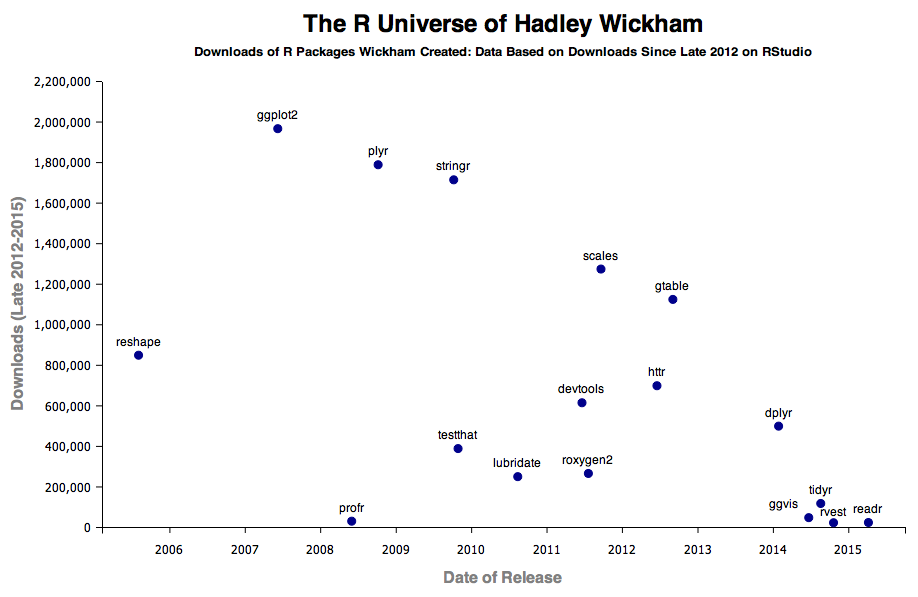

```{r setup, include=FALSE}
knitr::opts_chunk$set(echo = TRUE, comment = "")
```

# Download: <https://bit.ly/39a7RCI>

.center[

]

```{r message=FALSE, warning=FALSE}
# install.packages(tidyverse)
library(tidyverse) # including dplyr, tidyr, & ggplot ...
```

---

# Outline

.Large[
- introduction
- data.frame
- dplyr
- tidyr
- ggplot2
]


---

# Motivation

Data preprocessing takes 50-80% of your time in data analysis

Goal of Data Preprocessing  
- ake data suitable to use with a particular piece of software (i.e. R, - Python)  
- Reveal important information  
- Extract variables to analyze

---

# Hadley Wickham

- The Man Who Revolutionized R
- The Committee of Presidents of Statistical Societies Awards
- [tidyverse](https://www.tidyverse.org/)


---

.center[

]

---

.center[

]

---

# R packages for data science

.center[

]

---
class: inverse, center, middle

# data.frame


---

# data.frame() create

```{r}
student <- data.frame(
  ID = LETTERS[1:12], 
  math = round(rnorm(12, 50, 15), 1),
  chinese = seq(4, 92, length.out = 12))
student
```

--- 

# data.frame(): create

load data
```{r}
ebg001 <- read.csv("data/001_b_1110_1_1_p1.csv", 
                   fileEncoding = "UTF-8")
head(ebg001)
class(ebg001)
```

---

# data.frame(): read

```{r, eval=FALSE}
# []
ebg[1]
ebg["p1Cash"]

# [,]
ebg[1, 3]
ebg[1:10, 2:3]

# [[]]
ebg[[1]]

# $
ebg$StockPrice
ebg$p1Decision[61:100]
typeof(ebg)
```

---

# data.frame(): update

```{r}
student$psychology <- rep(c(59, 61), each = 2, times = 3)
student
```


---
class: inverse, center, middle

# dplyr

---

# tibble

```{r}
# install.packages("nycflights13")
data(flights, package = "nycflights13")
flights
```

---

# select()

```{r}
flight1 <- select(flights, year:day, tailnum, arr_delay, dep_delay, distance, air_time)
flight1
```

---

# filter()

```{r}
filter(flight1, year %in% c(2012, 2013), 
       month == 1, day < 4)
```

---

# sample_n() and sample_frac()

```{r}
sample_n(flight1, 3) # fixed number
sample_frac(flight1, 0.002) # fixed fraction
```

---

# arrange()

```{r}
arrange(flight1, year, month, day)
```

---

# arrange(desc())

```{r}
arrange(flight1, desc(arr_delay))
```

---

# mutate()

```{r}
mutate(flight1,
       gain = arr_delay - dep_delay,
       speed = distance / air_time * 60)
```

---

# select(mutate())


```{r}
select(
  mutate(flight1, 
         gain = arr_delay - dep_delay, 
         speed = distance / air_time * 60
  ),
  gain, speed
)
```

---

# transmute() == select(mutate())

```{r}
transmute(flight1, 
          gain = arr_delay - dep_delay,
          speed = distance / air_time * 60)
```

---

# nested structure 

It is very hard to read ...

```{r, eval=FALSE}
filter(
  summarise(
    select(
      group_by(flight1, year, month, day),
      arr_delay, dep_delay
    ),
    arr = mean(arr_delay, na.rm = TRUE),
    dep = mean(dep_delay, na.rm = TRUE)
  ),
  arr > 30 | dep > 30
)
```


---

# pip operator %>% 

```{r}
flight1 %>% 
  mutate(gain = arr_delay - dep_delay, 
         speed = distance / air_time * 60) %>% 
  select(gain, speed)
```

---

# summarise()

```{r}
flight1 %>% 
  summarise(delay_mean = mean(dep_delay, na.rm = TRUE), 
            delay_sd = sd(dep_delay, na.rm = TRUE))
```

---

# group_by() %>% summarise()

```{r}
flight1 %>%
  group_by(year, month) %>% 
  summarise(delay_mean = mean(dep_delay, na.rm = TRUE), 
            delay_sd = sd(dep_delay, na.rm = TRUE))
```


---

# left_join()

```{r}
flights2 <- flights %>% 
  select(month:day, tailnum, carrier) %>% 
  head(2)

data(airlines, package = "nycflights13")
airlines %>% head(3)
```

---

# left_join()

```{r}
flights2 %>% 
  left_join(airlines)
```

---

# left_join, right_join()

.pull-left[
```{r}
(df1 <- tibble(
  x = c(1, 2), y = 2:1))
(df2 <- tibble(
  x = c(1, 3), a = 10, 
  b = "HI"))
```
]

--

.pull-right[
```{r}
df1 %>% left_join(df2)
df1 %>% right_join(df2)
```
]

---

# inner_join()

```{r}
df1 %>% inner_join(df2)
```

---

# Practice

試著將同一組的 player 1 和 player 2 這兩筆資料給合併在同一個表格

--

```{r}
ebg002 <- read.csv("data/002_b_1110_1_1_p2.csv", 
                   fileEncoding = "UTF-8")
ebg_g1 <- ebg001 %>% 
  left_join(ebg002) 
DT::datatable(ebg_g1)
```


---
class: inverse, center, middle

# tidyr

---

# long vs. wide table


---

# wide table

```{r}
student
```

---

# pivot_longer()

```{r}
student_long <- pivot_longer(student, 
  cols = c("math", "chinese", "psychology"), # -ID 
  names_to = "subjects", values_to = "score")
student_long
```

---

# pivot_wider()

```{r}
student_wide <- pivot_wider(student_long,
  names_from = "subjects", values_from = "score")
student_wide
```

---

# Practice

試著把剛剛同組的 `ebg` 資料，利用 `boxplot(y~group, data)`，依照不同「資產類型」(Cash, Stock, Asset)，畫出它分佈。

--

```{r}
ebg_long <- ebg_g1 %>% 
    pivot_longer(
      cols = c("p1Cash":"p1TotalAsset", "p2Cash":"p2TotalAsset"),
      names_to = "money", values_to = "value")
boxplot(value ~ money, data = ebg_long)
```

---

# [Cheetsheet](https://www.rstudio.org/links/data_transformation_cheat_sheet)


---

# [Cheetsheet](https://www.rstudio.org/links/data_transformation_cheat_sheet)


---

# RStudio cheetsheets 

Link: <https://rstudio.com/resources/cheatsheets/>

In RStudio: Help > Cheetsheets > ...

---
class: inverse, center, middle

# ggplot2

---

---
---
---
---
---
# References

- `vignette("dplyr", package = "dplyr")`
- `vignette("", package = "dplyr")`
- ``


